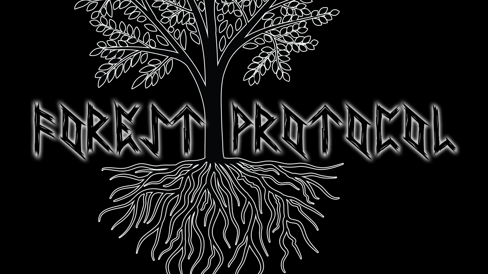

# Forest Protocol
## I. High Concept
A tower-based defense game set at night in the woods featuring magical creatures such as witches,
scary monsters such as spiders, and amazing heroes such as archers! The player uses money earned
from killing enemies to upgrade and buy towers to defend the land that is rightfull theirs!

## II. Genre
A tower-defense action game.

## III. Platform
Desktop only. If mobile users wish to play this game, they must buy the app in the App Store.

## IV. Story
The player resides among a group of settlers located in the center of a forest. They have been
forced to live there after all their other land was stolen. However, in the forest, there are
evil creatures and enemies who lurk the night. Determined not to let their land fall yet again,
the player and their most accomplished citizens must form strategies to defeat the evil that
threatens to permeate their home.

## V. Esthetics

### Graphics style

Cartoonish style, with dark themes throughout. "Don't Starve" is an excellent reference.

### Sound

Dark, ambient music. Use lots of woodwinds and percussion to build tension.

The other sounds for hit effects, damage taken, or enemy killed should be simple and cartoonish,
yet obvious and loud enough that the player can easily associate sounds with actions.

## VI. Gameplay
### Mechanics
Players can place towers which automatically attack enemies. Earning money leads to the ability
to buy and upgrade towers, to form a strategy that succeeds in defending against the enemy for
a specific level.

### Control
The players can play this game almost entirely with a mouse, as they merely need to click on
objects and towers to upgrade and use them.

### Teaching
The players will be taught during the first level. Instructions will be located at either side
of the screen so that players know what to do. The game is fairly straight-forward, so a detailed
tutorial is not really necessary.

### Player learning
The player will have to learn which towers effectively eliminate certain types of enemies. (I.E.-some
towers have stronger power, but slower firing speed, so using them on enemies of the same type would
make sense.) The map will also be strategically laid out so the player needs to use their positions wisely.
Each tower will have a certain range, and where that range is placed on the map matters a great deal.

## VII. Screenshots

## VIII. Other

## IX. About the developer(s)
Hi! I'm Alex Di Filippo and I am a 2nd Year Game Design and Development major! I am skilled in C#, HTML,
CSS, and the entire Adobe Suite (Photoshop, After Effects, Premiere, Etc.)! I also have a strong interest
in game music and sound, and have been actively creating my own assets in these categories for well over a
year now. I love the art aspect of games, but I tend to focus more on the programming side of things, although
I do love to dabble when I can! Game Design is my passion and I hope it is evident in this game! Enjoy!
